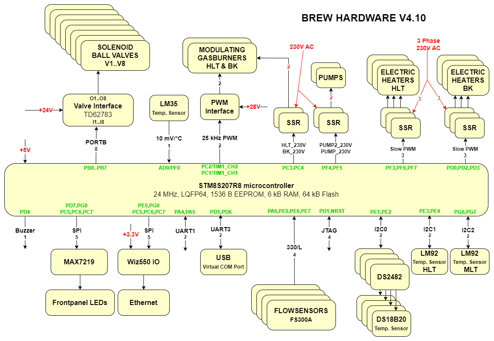
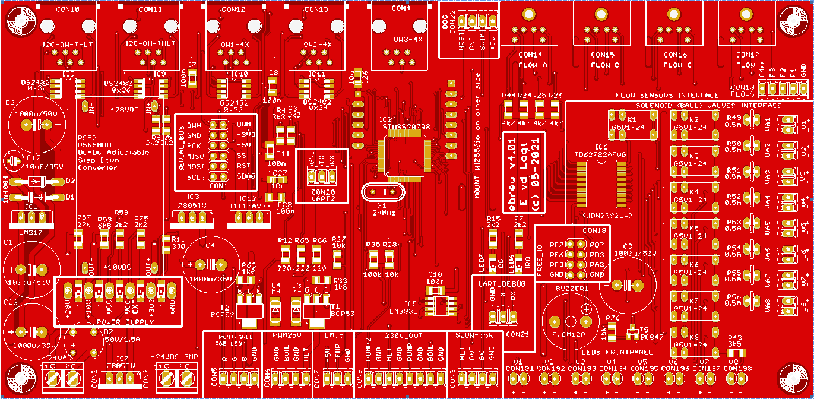

# Home-Brewery Automation
This respository contains the firmware for the STM8S207 microcontroller on the Brew hardware PCB.

# Features
The current PCB and firmware have the following features:
- Reading of **6 x temperature sensors**: two in the HLT (one I2C LM92, one One-Wire DS18B20), one in the MLT (I2C), one in the boil-kettle (One-Wire), one at the output of the counterflow-chiller (One-Wire) and one at the MLT return-manifold (One-Wire).
- Reading of **one hardware temperature** by a LM35 temperature sensor: this is used to protect the Solid State Relays (SSR) from overheating. The LM35 is typically mounted to a heatsink of one of the SSRs that switch a heating-element.
- Reading a maximum of **4 x FS300A flowsensors**: between HLT and MLT, between MLT and boil-kettle, one at the output of the counterflow-chiller and one at the entry of the MLT return-manifold.
- Control of **8 x solenoid ball-valves** at 24 V DC.
- **2 x PWM signals (25 kHz, 28 V DC)** for the modulating gasburners (HLT and boil-kettle burners).
- Control of **4 x SSR outputs at 230 V AC**: the pump, a second pump (for the HLT counterflow-chiller), 230 V enable for the HLT gasburner and 230 V enable for the boil-kettle gasburner.
- Control of **6 x SSR outputs at 230 V AC** for three phase heating-elements in HLT and boil-kettle. With this, heating of the HLT is possible with a gas-burner, with 1, 2 or 3 heating-elements of with any combination of these.
- **Synced SSR outputs** for HLT and boil-kettle, so that you only need **one three-phase connection**. The boil-kettle outputs have priority over the HLT outputs, meaning that if (on any phase of 230 V) both HLT and boil-kettle are heating, only the boil-kettle is activated.
  It is also possible to use just one (or two) of the three-phases, depending on the number of heating-elements inside the HLT and/or boil-kettle. The firmware is capable of addressing one, two or three heating-elements per kettle.
- **Ethernet and USB connection** to PC: USB-connection is used for debugging, main connection between PC-program and the firmware is Ethernet.
- **Frontpanel LEDs (24 in total)** that show the status of all actuators. They are controlled by a MAX7219 LED Display Driver.

# Block Diagram
 
*Block-diagram of the hardware*

Abbreviations used:
- **BK**: Boil-kettle, one of the three brewing kettles in a HERMS configuration. Contains the wort that needs to be boiled.
- **HLT**: Hot Liquid Tun, one of the three brewing kettles in a HERMS configuration. Contains fresh water of a certain temperature.
- **MLT**: Mash-Lauter Tun, one of the three brewing kettles in a HERMS configuration. Contains the wort with the grains and typically has a filter inside to leave the grains inside the MLT.
- **I2C**: A digital interface between ICs, one of the most commonly used interfaces to connect ICs and sensors to a microcontroller.
- **One-Wire**: A digital interface between a sensor and a microcontroller, consisting of only one signal wire.
- **PWM**: Pulse Width Modulation, a signal representation that is used to control an actuator. It is a square-wave of which the duty-cycle is varied between 0 % and 100 %.
- **SPI**: a digital interface between ICs and a microcontroller. Together with the **I2C** interface, it is commonly found on a microcontroller.
- **SSR**: Solid State Relay, a device that switches 230 V AC and is controlled by a 5V signal from the microcontroller.

Integrated Circuits (IC) used:
- **STM8S207R8**: an 8-bits microntroller from STM-microelectronics running on 24 MHz and has 64 kB Flash onboard. If has 56 free GPIO pins available.
- **TD62783**: an 8-channel high-voltage Source Driver, they can switch up to 50 V and 500 mA per channel. Used here the switch the solenoid ball-valves.
- **LM35**: a precision centrigrade temperature sensor, delivering 10 mV per °C. The analog value is read in by one of the AD-converters of the STM8S207.
- **LM92**: a 12-bit + sign digital temperature sensor with I2C interface.
- **DS18B20**: an One-Wire 12-bit digital temperature sensor.
- **DS2482**: an I2C to One-Wire bridge, connects to a microcontroller via the I2C interface and controls a One-Wire device, such as the DS18B20.
- **MAX7219**: a LED display-driver IC, capable of addressing 8 7-segment displays or 64 individual LEDs. It has an SPI-interface. The MAX7219 controls the 24 Frontpanel LEDs of the brewing hardware.
- **Wiz550IO**: an auto configurable Ethernet controller that includes a W5500 (TCP/IP hardwired chip and PHY embedded), a transformer and RJ45 connector.

More hardware and firmware design details: see my website: http://www.vandelogt.nl/uk_hardware.php. Note that the description there is still for the old hardware version, based around an Arduino Nano.

# Printed Circuit Board (PCB)
 
*Top view of v4.01 prototype PCB, as made by JLCPCB*

# Software Development Environment
Use with IAR-STM8.

# Interface with PC
The Brew-Hardware uses a network cable as its main-connection to the PC. This is powered through a WIZ550IO module. It uses DHCP to obtain an IP address automatically.
The standard port number for the firmware is set to 8888. 

The Brew-hardware also uses two virtual COM ports as a backup connection to the PC. Virtual COM port settings are (115200,N,8,1).

Typically the PC-program sends commands to the Brew-Hardware, like **P0** (Pump Off) or **P1** (Pump On). These commands are then executed by the firmware of the Brew-Hardware.
Although you can type in the commands manually, it is more efficient to use a dedicated PC-program for it, with a Graphical User Interface.

If you install the Brew-Hardware PCB for the first time, it is best to use a terminal program that can handle a virtual COM port (I had good results with Realterm). At initial power-up, you can type **S0** to retrieve
the version number of the firmware (and to check that everything is working). The **E1** command enabled the Ethernet module, if everything goes well, the IP address of the Brew-Hardware is returned.

More information about the PC-Interface can be found at my website: http://www.vandelogt.nl/uk_hardware.php#PC_INTF

